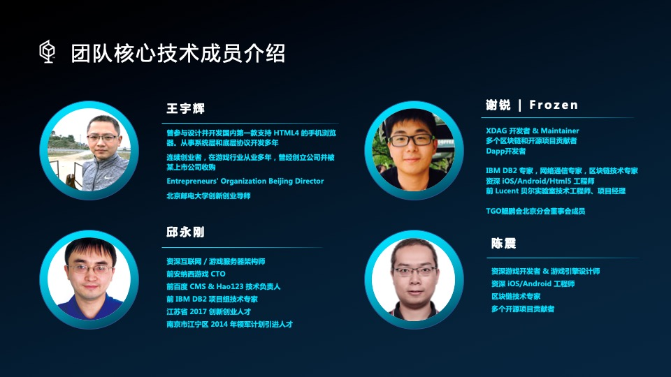
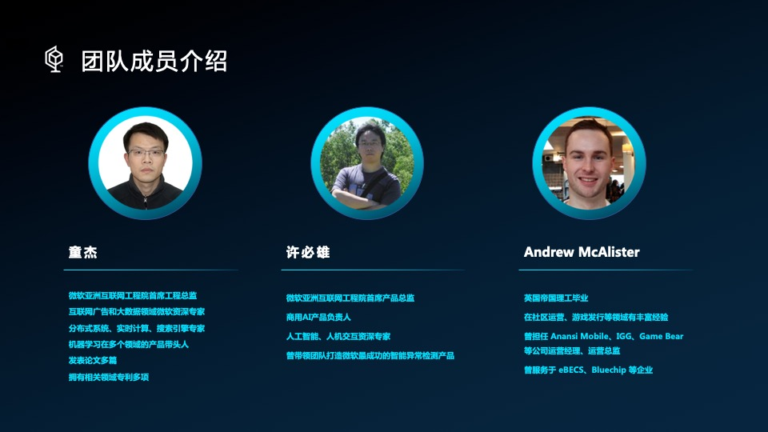
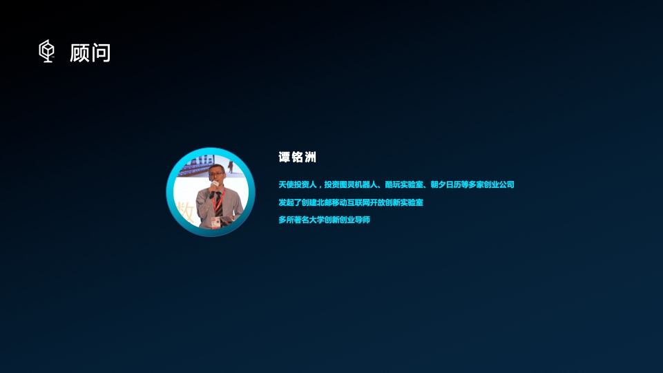

北京共识之道科技有限公司成立于2018年，由一群曾经服务于百度、IBM、朗讯，又曾独立创业并取得成功的互联网老兵创建。公司的创始人们经历了互联网和移动互联网大潮的诞生与发展，看到了区块链以及以此为代表的去中心化技术推动社会进步的巨大潜力，希望以全部的热情投身于这场未来的浪潮之中，以前瞻性的眼光看待整个行业，并打造出实质性的创新和实用性的使用场景。

企业使命：开发极具创新性的去中心化技术，并借此推动社会的进步。

未来愿景：创造一个可以永远运行的去中心化网络。

